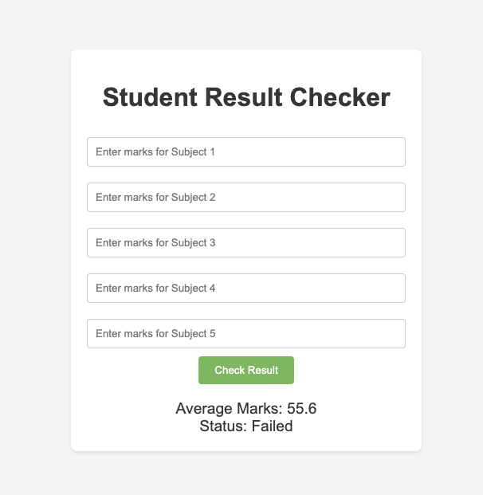

<!-- DON't CHANGE THIS FILE! -->

Assignment: BIT_05_001

## OPPss... Something is not working this project. 
Looks like your teacher have written some shi**y code here. 
He needs your help to Fix this project by tomorrow morning. Can you solve all the issue? 
For now all you have to now is :
- Pass marks for all student should 40 marks (on each subject).
- If student can't get 40 marks on any of the subject, he/she should be failed.
- hint: there are syntax and logical error as well.

Details of the project can be found below.

# Student Result Checker

This project is a simple PHP application that allows users to input student marks for different subjects and determine if the student has passed or failed. The application calculates the average marks and checks if the student has passed all subjects based on a minimum passing mark.

## Features

- Input marks for five subjects.
- Calculate the average marks.
- Determine pass/fail status based on individual subject marks.
- Simple and responsive UI using HTML and CSS.

## Installation

1. Ensure you have a local server environment set up.
2. Start your local server on port 8000.
3. Go to your browser to run the project e.g `http:\\localhost:8000`

## Usage

1. Open your web browser and navigate to `http:\\localhost:8000` (replace `student-result-checker` with the actual directory name if different).
2. Enter the marks for each subject in the provided input fields.
3. Click the "Check Result" button.
4. The application will display the average marks and the student's pass/fail status.

### Code Explanation

- **calculateAverage($marks)**: Calculates the average of the given marks.
- **checkPassOrFail($marks, $passMark)**: Checks if the student has passed all subjects based on the given passing mark.

# How to push the fix?
- Clone the project as explained above.
- Create the new branch with your name e.g `git checkout -b roshan-shrestha`
- Fix the code, test yourself and push the changes to your branch
- Make sure to add the code to git with `git add .` & push.
- You can push as many time you want. 
Remember even if you can't fix the code, please send your version.

